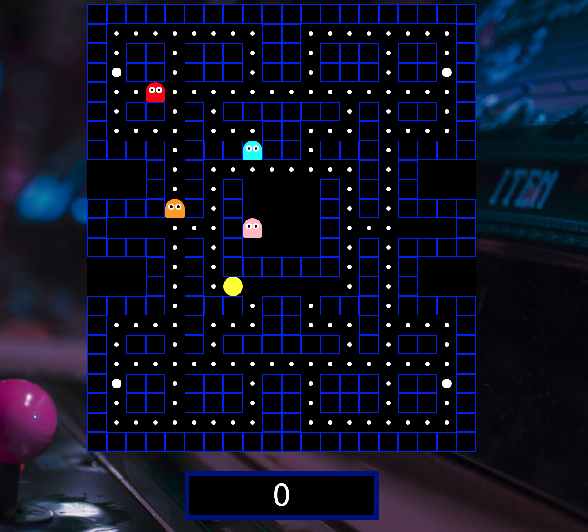

# 🎮 Pacman Game - JavaScript



Um clássico jogo do Pacman desenvolvido com JavaScript puro, HTML e CSS. Este projeto recria a experiência nostálgica do arcade com fantasmas perseguindo e power-ups estratégicos.
https://jogo-pacman-psi.vercel.app/

## ✨ Funcionalidades

- **Movimento fluido do Pacman** com controles de teclado (↑ ↓ → ←)
- **4 fantasmas** (Blinky, Pinky, Inky e Clyde)
- **Sistema de pontuação** com dots e power pellets
- **Efeitos visuais** como animação de rotação do Pacman
- **Modo power pill** quando o Pacman come power pill
- **Tela de game over** e vitória

## 🛠️ Tecnologias

- JavaScript ES6+
- HTML5 Canvas/CSS Grid
- NPM (para ambiente de desenvolvimento)

## 🚀 Como Executar

1. **Clone o repositório**
   ```bash
   git clone https://github.com/Srhiulli/Jogo-Pacman.git
   cd pac-man
   ```

2. **Instale as dependências**
   ```bash
   npm install
   ```

3. **Inicie o jogo**
   ```bash
   npm start
   ```
   *(Isso iniciará um servidor local, em `http://localhost:1234`)*

4. **Controles**
   - **Setas do teclado**: Movimentam o Pacman

## 🏗️ Estrutura do Projeto

```
pacman-js/
├── src/
│   ├── js/
│   │   ├── GameBoard.js    # Lógica do tabuleiro
│   │   ├── Pacman.js       # Personagem principal
│   │   ├── Ghosts.js       # Inimigos
│   │   └── setup.js        # Constantes e configurações
│   ├── index.html          # Estrutura principal
│   └── styles.css          # Estilos visuais
├── package.json
└── README.md
```

## 🧠 Lógica dos Fantasmas (será implementada)

Os fantasmas implementam diferentes comportamentos:
- **Blinky** (vermelho): Persegue agressivamente
- **Pinky** (rosa): Tenta interceptar
- **Inky** (ciano): Comportamento imprevisível
- **Clyde** (laranja): Alterna entre perseguir e fugir

## 📌 Próximas Melhorias

- [ ] Adicionar sons de jogo
- [ ] Implementar níveis progressivos
- [ ] Lógica dos fantasmas

## 🤝 Como Contribuir

1. Faça um fork do projeto
2. Crie sua branch (`git checkout -b feature/nova-feature`)
3. Commit suas mudanças (`git commit -m 'Add some feature'`)
4. Push para a branch (`git push origin feature/nova-feature`)
5. Abra um Pull Request

---

**Desenvolvido com ❤️ por Sarah Iulli**  
